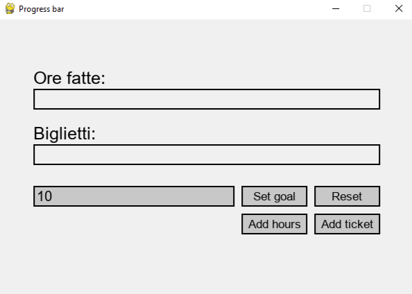

# Progress bar for hack club

I've built a simple progress bar with pygame to track my progres in hack club.

## How to use
After running main.py, the screen below will be displayed

Firstly you need to set a goal, in order to do that just click on the text bar to select it and write the number of ticket to collect then click on "Set goal"

After that you register the ticket you have by writing a number and then clicking "add ticket"

and add the hours

